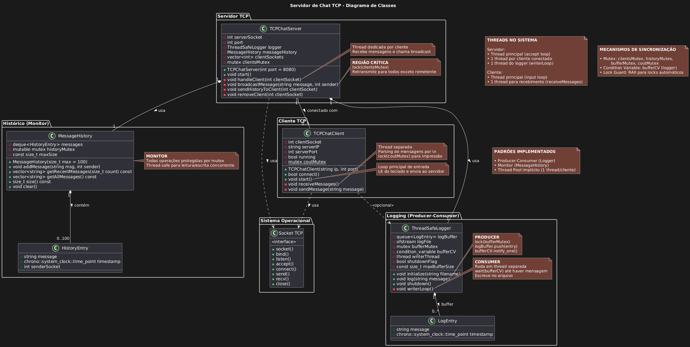
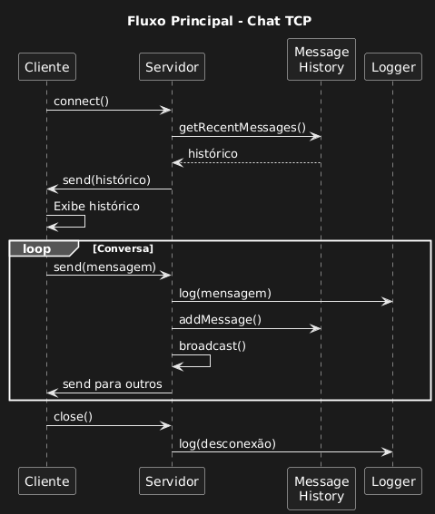

# Servidor de Chat Multiusuário TCP - Etapa 1

## 📖 Sobre o Projeto

Este projeto implementa um **Servidor de Chat Multiusuário TCP** desenvolvido em C++ como trabalho final da disciplina de Programação Concorrente. O sistema demonstra o domínio prático de conceitos fundamentais de programação concorrente, incluindo:

- 🧵 **Threads** e gerenciamento de concorrência
- 🔒 **Exclusão mútua** com mutexes
- 📢 **Variáveis de condição** para sincronização
- 🛡️ **Monitores** para proteção de estruturas compartilhadas
- 🌐 **Sockets TCP** para comunicação em rede

### 🎯 Objetivos do Sistema Completo

O projeto será desenvolvido em 3 etapas:

1. **Etapa 1** ✅ - Arquitetura + biblioteca libtslog thread-safe
2. **Etapa 2** 🚧 - Protótipo CLI com comunicação TCP básica
3. **Etapa 3** 🔜 - Sistema completo cliente/servidor com broadcasting

## 🏗️ Arquitetura Atual (Etapa 1)

### 📚 Biblioteca libtslog

A **libtslog** é uma biblioteca de logging thread-safe personalizada que implementa o padrão **Producer-Consumer**:

- ✅ **Thread-Safe**: Múltiplas threads podem fazer log simultaneamente
- 🎯 **Eficiente**: Buffer interno com thread dedicada para escrita
- 🔄 **Padrão Producer-Consumer**: Otimiza I/O de arquivo
- ⚡ **Controle de Overflow**: Limita buffer a 1000 entradas

### 📊 Diagramas e Documentação Visual

Os diagramas foram gerados para facilitar o entendimento da arquitetura e dos fluxos de execução:

### Diagrama de Classes (UML)


### Diagrama de Sequência


### Fluxograma da Thread Escritora


Visualize-os para compreender a estrutura das classes, a interação entre threads e o algoritmo de processamento de logs.

## 📁 Estrutura do Projeto

```
Servidor-de-Chat/
├── 📂 img/                    # Diagramas e documentação visual
│   ├── diagrama-classes.png
│   ├── diagrama-sequencia.png
│   └── fluxograma-logger.png
├── 📂 build/                  # Makefile e executáveis
│   ├── Makefile
│   └── chat_server            # Executável gerado
├── 📂 lib/                    # Arquivos de cabeçalho
│   ├── libtslog.h
│   └── logEntry.h
├── 📂 src/                    # Código fonte
│   ├── libtslog.cpp
│   └── main_server.cpp
├── 📄 README.md               # Este arquivo
├── 📄 chat_server.log         # Arquivo de log gerado
└── 📄 .gitignore
```

## 🚀 Como Compilar e Executar

### 📋 Pré-requisitos

- **Compilador**: g++ com suporte a C++17 ou superior
- **Sistema**: Linux/Unix (testado em Ubuntu)
- **Dependências**: pthread (normalmente já incluída)

### 🔨 Compilação

```bash
cd Servidor-de-Chat/build/
make
```

### ▶️ Execução

```bash
make run
```

Verifique o arquivo `chat_server.log` gerado.

## 🔧 API da libtslog

```cpp
ThreadSafeLogger logger;
logger.initialize("arquivo.log");
logger.log("Sua mensagem aqui");
logger.shutdown();
```

## 🚧 Próximas Etapas

- **Etapa 2**: Servidor TCP e cliente CLI básicos
- **Etapa 3**: Broadcasting, gerenciamento de clientes e relatório final

---
