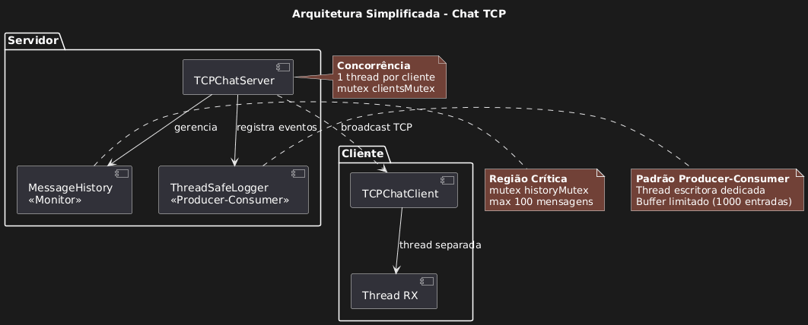
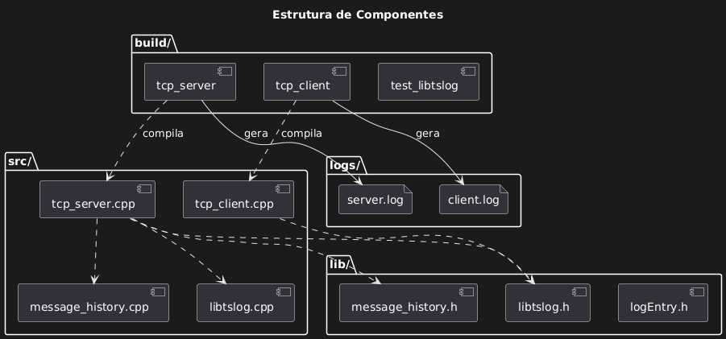

## 📖 Sobre o Projeto

Este projeto implementa um **Servidor de Chat Multiusuário TCP** desenvolvido em C++ como trabalho final da disciplina de Programação Concorrente. O sistema demonstra o domínio prático de conceitos fundamentais de programação concorrente, incluindo threads, exclusão mútua com mutexes, variáveis de condição, monitores e sockets TCP.

### 🎯 Roadmap do Projeto

1. **Etapa 1** ✅ - Arquitetura + biblioteca libtslog thread-safe
2. **Etapa 2** ✅ - Protótipo CLI com comunicação TCP básica
3. **Etapa 3** ✅ - Sistema completo com monitores, histórico e RAII

---

## ✨ Novidades da Etapa 3

### 🗄️ Histórico de Mensagens Thread-Safe
- **Monitor Pattern**: Classe `MessageHistory` implementa padrão monitor completo
- **Timestamps automáticos**: Cada mensagem registrada com `[HH:MM:SS]`
- **Auto-envio**: Novos clientes recebem automaticamente as últimas 10 mensagens
- **Capacidade**: Histórico circular de até 100 mensagens em memória
- **Thread-safe**: Todas operações protegidas por `mutable mutex`

### 🔒 Smart Pointers e RAII
- **SocketGuard**: Wrapper RAII para file descriptors (fecha automaticamente)
- **std::unique_ptr**: Gerenciamento de threads
- **std::shared_ptr**: Gerenciamento de clientes compartilhados entre threads
- **Exception-safe**: Cleanup automático mesmo em caso de exceções
- **Zero memory leaks**: Sem `delete` ou `close()` manual

### 🧪 Sincronização Determinística com Barrier
- **Novo teste de stress**: `make stress-test` usa Barrier Pattern
- **Condition Variable**: Sincronização real entre 5 clientes simultâneos
- **Hardware-independent**: Não depende de delays fixos (`sleep`)
- **Demonstra conceitos**: Uso prático de `std::condition_variable` e `std::mutex`
- **Diferencial**: Todos os clientes aguardam na barreira e enviam mensagens **simultaneamente**

### 🎨 Interface de Usuário Melhorada
- **Prompt visual**: Indicador `>` para entrada de texto
- **Limpeza de linha**: Mensagens recebidas não sobrescrevem o prompt
- **Comandos**: `sair`, `exit`, `quit` para encerrar gracefully
- **Thread separada**: Recebimento de mensagens em background

### 📊 Padrões de Design Implementados
- **Producer-Consumer**: ThreadSafeLogger com buffer e condition variable
- **Monitor**: MessageHistory com encapsulamento de sincronização
- **Barrier**: Sincronização de N threads (test_sync_clients.cpp)
- **RAII**: Gerenciamento automático de recursos (SocketGuard)

---

---

## 🚀 Como Compilar e Executar

### 📋 Pré-requisitos

- **Compilador**: g++ com suporte a C++17 ou superior
- **Sistema**: Linux/Unix
- **Dependências**: `pthread`

### 🔨 Compilação

```

cd build/
make all

```

Compila:
- `tcp_server` - Servidor de chat
- `tcp_client` - Cliente CLI
- `test_libtslog` - Teste da biblioteca de logging
- `test_sync_clients` - Teste sincronizado com barrier

---

### ▶️ Execução Manual

#### 1. Servidor
```

make run-server

```
- Inicia na porta 8080
- Logs em `logs/server.log`
- Aceita múltiplos clientes simultâneos

#### 2. Cliente
```

make run-client

```
- Conecta em `localhost:8080`
- Interface com prompt `>`
- Logs em `logs/client.log`

#### 3. Cliente Customizado
```

make run-client-custom SERVER_IP=192.168.0.10 SERVER_PORT=8080

```
- Conecta em IP/porta específicos
- Útil para testes em rede

---

## 📐 Arquitetura do Sistema

### Visão Simplificada



O diagrama acima mostra a arquitetura de alto nível do sistema, destacando:
- **Servidor**: `TCPChatServer` com 1 thread por cliente conectado
- **Cliente**: `TCPChatClient` com thread separada para recebimento (Thread RX)
- **Histórico**: `MessageHistory` implementando padrão Monitor
- **Logger**: `ThreadSafeLogger` implementando Producer-Consumer
- **Regiões Críticas**: Protegidas por mutexes (clientsMutex, historyMutex, bufferMutex)

### Diagrama de Classes


Detalhamento completo das classes do sistema:
- **Estrutura completa** de `TCPChatServer` e `TCPChatClient`
- **Histórico (Monitor)**: `MessageHistory` com `HistoryEntry`
- **Logging (Producer-Consumer)**: `ThreadSafeLogger` com `LogEntry`
- **Padrões implementados** claramente identificados
- **Mecanismos de sincronização** (Mutex, Condition Variable)
- **Threads no sistema** (servidor, clientes, logger)

### Fluxo de Interação


Diagrama de sequência mostrando:
- **Conexão do cliente** e envio automático de histórico
- **Loop de conversa** (envio de mensagem → log → histórico → broadcast)
- **Desconexão limpa** com logging

### Estrutura de Componentes



Mapeamento da estrutura de build:
- **build/**: Binários gerados (`tcp_server`, `tcp_client`, `test_libtslog`)
- **src/**: Arquivos fonte (`.cpp`)
- **lib/**: Headers (`.h`)
- **logs/**: Logs gerados durante execução

---

## 📁 Estrutura do Projeto

```

Servidor-Chat-TCP/
├── 📂 build/
│   ├── 📁 obj/                # Objetos compilados
│   ├── 📁 logs/               # Logs gerados
│   └── Makefile
├── 📂 lib/
│   ├── libtslog.h             # Logger thread-safe
│   ├── logEntry.h             # Estrutura de entrada de log
│   ├── message_history.h      # Monitor de histórico (NOVO)
│   └── socket_guard.h         # RAII para sockets (NOVO)
├── 📂 src/
│   ├── libtslog.cpp           # Implementação do logger
│   ├── message_history.cpp    # Implementação do histórico (NOVO)
│   ├── tcp_server.cpp         # Servidor com smart pointers (ATUALIZADO)
│   ├── tcp_client.cpp         # Cliente com prompt visual (ATUALIZADO)
│   └── test_libtslog.cpp      # Teste da biblioteca
├── 📂 scripts/
│   └── test_sync_clients.cpp  # Teste sincronizado com Barrier (NOVO)
├── 📂 img/
│   ├── diagrama-arquitetura.jpg     # Visão simplificada
│   ├── diagrama-classes.jpg         # Diagrama de classes UML
│   ├── diagrama-sequencia.jpg       # Diagrama de sequência
│   └── estrutura-componentes.jpg    # Estrutura de build
├── 📄 Relatorio.pdf        # Relatório de análise (NOVO)
├── 📄 README.md
└── 📄 .gitignore

```

### 🧪 Testes Automatizados

#### Teste Básico (3 clientes sequenciais)
```
make test-tcp
```
- Inicia servidor automaticamente
- Conecta 3 clientes sequencialmente
- Cada cliente envia mensagens e desconecta
- Exibe estatísticas de conexões e mensagens
- Logs individuais para cada cliente

#### Teste de Stress com Sincronização (5 clientes + Barrier)
```
make stress-test
```
**Diferencial da Etapa 3:**
- Usa **Barrier Pattern** com `std::condition_variable`
- 5 clientes conectam simultaneamente
- **Aguardam na barreira** até todos estarem conectados
- Enviam mensagens **sincronizadas** (não usa `sleep`)
- Demonstra sincronização determinística e hardware-independent
- Logs em `logs/server_sync.log`


Exemplo de saída:
```
🧪 Teste de Sincronização com 5 clientes

✅ Cliente 1: Conectado
✅ Cliente 2: Conectado
✅ Cliente 3: Conectado
✅ Cliente 4: Conectado
✅ Cliente 5: Conectado
🚀 Cliente 1: Enviando mensagem 
🚀 Cliente 2: Enviando mensagem
🚀 Cliente 3: Enviando mensagem
🚀 Cliente 4: Enviando mensagem
🚀 Cliente 5: Enviando mensagem

✅ Teste concluído!
```

---

## 📊 Gerenciamento de Logs

```
make logs-summary # Resumo de todos os logs
```
```
make logs-tail # Monitorar servidor em tempo real
```
```
make debug-logs # Análise detalhada do servidor
```
```
make clean-logs # Limpar logs (preserva binários)
```
```
make clean-all # Limpeza completa
```

---

## 🔍 Funcionalidades de Concorrência

### Mecanismos de Sincronização
- **Mutex**: `clientsMutex`, `historyMutex`, `bufferMutex`, `coutMutex`
- **Condition Variable**: Logger (Producer-Consumer), **Barrier (stress-test)**
- **Lock Guard**: RAII para locks automáticos
- **Smart Pointers**: Gerenciamento automático de lifetime

### Padrões Implementados
- **Monitor**: `MessageHistory` - operações atômicas thread-safe
- **Producer-Consumer**: `ThreadSafeLogger` - thread escritora dedicada
- **Barrier**: `test_sync_clients` - sincronização de N threads
- **RAII**: `SocketGuard` - cleanup automático de recursos

### Recursos Thread-Safe
✅ Broadcasting de mensagens  
✅ Histórico de mensagens  
✅ Logging concorrente  
✅ Gerenciamento de clientes  
✅ Saída de terminal (std::cout)  

---

## 🎓 Conceitos Demonstrados

- ✅ Threads (1 por cliente + logger + receiveMessages)
- ✅ Mutex e Lock Guards
- ✅ Condition Variables (logger e **barrier**)
- ✅ Monitores (MessageHistory)
- ✅ Producer-Consumer (ThreadSafeLogger)
- ✅ Barrier Pattern (test_sync_clients)
- ✅ Sockets TCP
- ✅ Broadcasting
- ✅ Smart Pointers (RAII)
- ✅ Exception Safety

---

## 🏆 Destaques Técnicos

- **Zero memory leaks**: Gerenciamento automático com smart pointers
- **Exception-safe**: RAII garante cleanup mesmo com erros
- **Protocolo de framing**: Mensagens delimitadas por `\n`
- **Thread-safety garantida**: Todas regiões críticas protegidas
- **Hardware-independent**: Teste de stress usa sincronização real, não timing
- **Sincronização determinística**: Barrier garante comportamento previsível